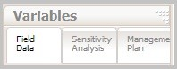
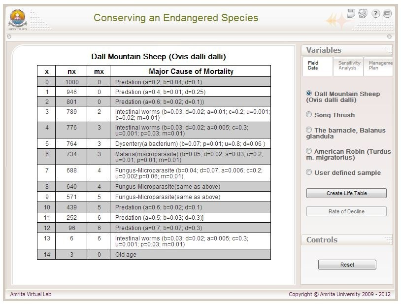
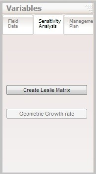
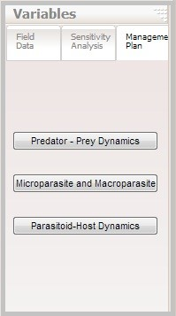
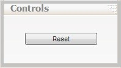

### Procedure

#### User instructions
The simulator consists of three regions: the simulator's viewable window, the variables menu and the simulation control menu.
 
##### The Variables Menu:
The variables menu section consists of three sub-tabs:

###### Field Data:
To choose a field data from the provided examples or the user can enter their own data.

###### Sensitivity Analysis:
A method to analyze the sensitivity of each age class.

###### Management Plan:
To choose and apply an appropriate management plan to conserve the species.

&nbsp;

 
First the user needs to select a filed data of any of the four examples provided or they can enter their own sample data. The field data of the species Dall Mountain Sheep, Song Thrush, Balanus glandula and American Robin are provided as examples. By default, the first example is clicked under the Field data tab and the corresponding data is shown in the viewable window.
 

&nbsp;

There are two buttons under the Field data tab. One is to create a life table from the selected field data and the other one is to estimate the rate of decline of that particular species. The equations used for this are explained in the theory section.
 
The next step is to perform a sensitivity analysis to determine which part of the life history has the greatest effect on the population growth rate. This is useful to design a management plan to recover the species.  Construction of a Leslie matrix from the life table is one of the essential steps in doing a sensitivity analysis. We can calculate the geometric growth rate of the population from this matrix. The mathematics behind the sensitivity analysis is also explained the theory section.

&nbsp;

Once the age related mortality factor (from sensitivity analysis) is known, a management plan can be directed to that particular factor. The ‘management plan’ tab provides three methods to conserve the population based on the mortality factor given in the field data for that particular age class which is most sensitive. In this exercise the simulator provides three different management plans (Predator-Prey dynamics, Microparasite and Macroparasite or Parasitoid-Host Dynamics) which are already developed in the population ecology virtual labs. 
 

&nbsp;

User can select any suitable model according to the mortality factor of the sensitive age class and can apply the parameters (the major cause of mortality) from the life table and then modify these values in such a way that to recover the population.
 
#### Simulation Controls Menu:
 

&nbsp;

The 'Reset' button under the simulation controls menu resets the simulator to the default values.