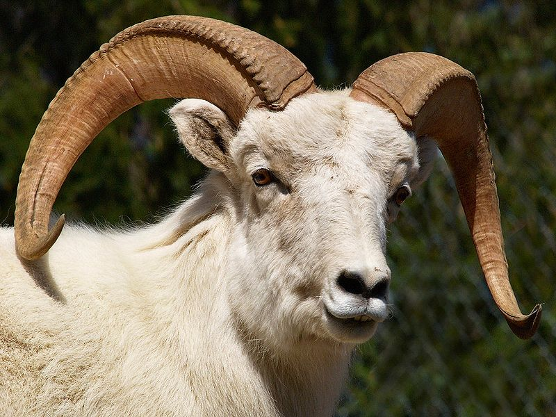
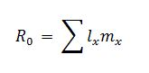
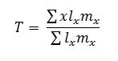
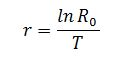
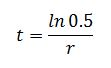
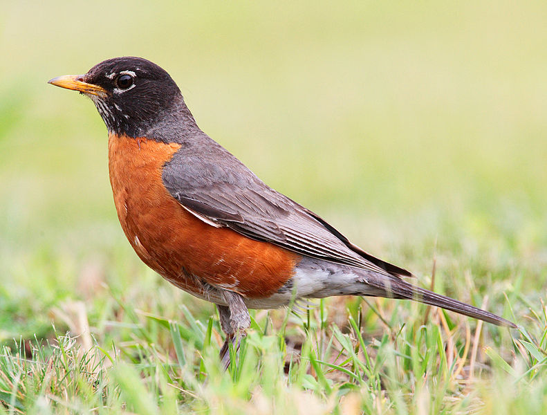

### Theory
 
A population of organisms which is at a high risk of extinction because it is either less in numbers, or threatened by changing environmental or other factors such as predation is known as an endangered species. Animals become endangered for number of reasons like overhunting, destruction of their natural habitats and forests for personal purposes, climate changes etc. The interspecific and intra specific competition for resources also a play an important role.

The equilibrium of the ecosystem should be maintained as it is important for the welfare of all the living beings including human. We must have to take actions to conserve and and repopulate these threatened species to maintain the biodiversity of our planet.  Many nations enforcing some laws which offering protection to threatened species: for example, forbidding hunting, restricting land development or creating preserves as well as designing several plans to repopulate the species. 

&nbsp;

The essential step in preventing the extinction is to understand the growth dynamics of the endangered species. In this exercise we will study the dynamics of such species so as to figure out a productive way of reversing the fall in their numbers by means of mathematical simulation. It is explained with some examples of endangered species such as Dall Mountain Sheep (Ovis dalli dalli),Song Thrush, Balanus glandula and American Robin (Turdus m. Migratorius).

 

The conservation approach explained in this exercise consists of the following steps:

1. Construction of a life table from the field data
2. Calculation of the rate of decline
3. Sensitivity analysis
4. Development and application of a management plan

&nbsp;

### Construction of a Life Table from the Field Data                           

Population biologists and demographers are interested in studying the dynamics of population growth and structure. There are a number of methods to present the statistics of different populations. 'Life table' is one among such methods. It is a table that presents data on the age specific mortality and survivorship of a population and can be used to compare populations under different circumstances. Life tables describe how mortality varies with age over a time period corresponding to maximum life span. The data collection to construct a life table requires a group of field biologists and takes many years to complete. The field data of the species Dall Mountain Sheep, Song Thrush, Balanus glandula and American Robin is adapted from Edward S. Deevey, Jr, 1947.

&nbsp;

&nbsp;

The variables used in the field data and the life table are:

• x , Age class 

• nx , Number of survivors in each age class 

• mx , Average female offspring per female of a given age in the population 

• Fx , fecundity value 

• lx , The proportion of original cohort surviving to time x (Number alive at age x / number at age zero ).

&nbsp;
### Calculation of the Rate of Decline
 
To predict the population size in future, we need an initial estimate of the population growth rate. Also it is helpful if we can calculate the time taken by the population to become half the initial size. These statistics can be obtained by calculating the net replacement rate (R0), the generation time (T), and the continuous rate of growth (r) from the data in the life table.

 

The following are the equations used to calculate the R0, T and r

&nbsp;

The equation used to calculate the time taken by the population to decrease to half its initial size (t) is,

&nbsp;

### Sensitivity Analysis
 
The purpose of doing a sensitivity analysis is to determine which part of the life history has the greatest effect on the population growth rate. Once this age related mortality or fecundity factor is known, a management plan can be aimed directly at that factor.

Constructing a Leslie matrix from the obtained life table is the first step in a sensitivity analysis. We can create a Leslie matrix by calculating px and Fx values from the life table and arranging them in age-structured matrix. For more information on constructing a Leslie matrix, refer the experiment “Age Structured Leslie Matrix” in Population Ecology Lab I. The next step is to change each feature of the Leslie matrix and observe the effect on the population growth rate R. To do this, one need to change, one by one, each px value to 1. The change in px value will change the corresponding Fx value also. The matrix should be changed back to the original values after the each changes in the px and calculate the eigenvalue of the matrix for each change. Find out the largest eigenvalue of those matrices. This is the geometric growth rate for a population with discrete growth. The sensitivity of each class can be analysed using this method.

&nbsp;

### Development and Application of a Management Plan
 

From the above explained methods it is known that which age class has the greatest effect on the population growth rate of a particular endangered species. Also the major cause of mortality at that age can be obtained from the life table. It is helpful to develop a management plan to repopulate or recover that particular species. User can select a suitable model (Predator-Prey dynamics, Microparasite and Macroparasite or Parasitoid-Host Dynamics) and can apply the parameters (the major cause of mortality) from the life table and then modify these values in such a way that to recover the population.

 

 Image source: http://en.wikipedia.org    

 

